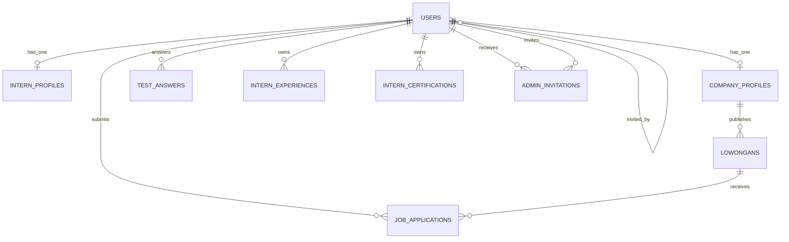
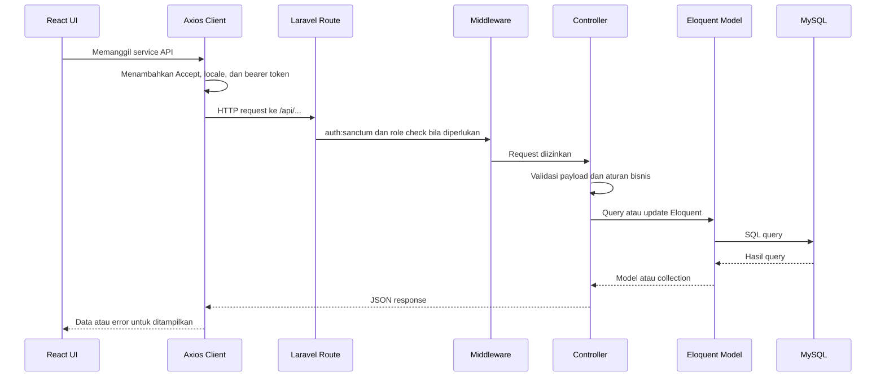
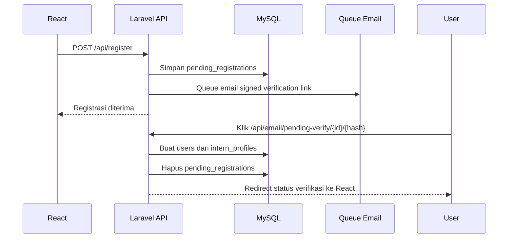

# Laporan Teknis Backend Laravel Vocaseek

## Informasi Dokumen

| Item | Keterangan |
|---|---|
| Nama project | **Vocaseek** |
| Fokus analisis | Backend Laravel dan integrasi API dengan frontend React |
| Framework backend | Laravel 12 |
| Bahasa pemrograman | PHP 8.2 atau lebih baru |
| Database utama | MySQL |
| Tanggal analisis source code | 31 Mei 2026 |

Dokumen ini disusun berdasarkan implementasi aktual pada source code backend, khususnya folder `app`, `routes`, `config`, `database`, `docs`, dan konfigurasi deployment Docker. Bagian frontend React dibaca secara terbatas untuk menjelaskan pola integrasi API.

---

## 1. Nama Project

Nama sistem adalah **Vocaseek**.

Vocaseek merupakan platform pencarian dan pengelolaan kesempatan magang yang mempertemukan peserta magang atau pelamar (`intern`) dengan perusahaan mitra (`company`). Sistem juga menyediakan area administrasi untuk melakukan verifikasi perusahaan, pemantauan talenta, serta pengelolaan akun admin internal.

---

## 2. Tujuan Utama Sistem

Tujuan utama Vocaseek adalah menyediakan proses rekrutmen magang yang terintegrasi dalam satu platform. Backend Laravel bertindak sebagai pusat pengelolaan data dan aturan bisnis untuk:

1. Registrasi dan autentikasi pengguna.
2. Verifikasi email sebelum akun baru diaktifkan.
3. Verifikasi legalitas perusahaan sebelum mitra dapat menggunakan sistem.
4. Pengelolaan profil, dokumen, dan riwayat akademik pelamar.
5. Pelaksanaan pre-test pelamar.
6. Publikasi lowongan oleh perusahaan.
7. Pengiriman dan pemantauan lamaran.
8. Peninjauan kandidat oleh perusahaan.
9. Pengelolaan mitra, talenta, serta admin internal.

---

## 3. Permasalahan yang Diselesaikan

Vocaseek dirancang untuk menjawab beberapa permasalahan proses magang yang sering dilakukan secara terpisah:

| Permasalahan | Solusi dalam Vocaseek |
|---|---|
| Informasi lowongan magang tersebar dan sulit dipantau | Lowongan aktif disimpan terpusat dan dapat ditampilkan melalui API publik. |
| Profil pelamar dan dokumen pendukung dikirim berulang kali | Pelamar memiliki profil digital yang memuat biodata, akademik, CV, portofolio, dokumen pendidikan, KTP, transkrip, pengalaman, dan sertifikasi. |
| Perusahaan perlu menilai kesiapan awal pelamar | Backend menyediakan pre-test terstruktur dengan batas waktu dan hanya dapat diselesaikan satu kali. |
| Status lamaran sulit dipantau oleh pelamar | Riwayat lamaran dan status seleksi tersedia melalui endpoint khusus intern. |
| Perusahaan mitra perlu diverifikasi sebelum mempublikasikan lowongan | Registrasi company menyimpan NIB, LoA, dan akta pendirian untuk ditinjau admin. |
| Hak akses admin perlu dibedakan | Sistem memisahkan `super_admin` dan `staff_admin`, termasuk pembatasan persetujuan final dan pengelolaan akun admin. |
| Aktivasi akun admin baru perlu lebih terkontrol | Akun staff admin dibuat melalui invitation link bertoken, memiliki masa berlaku, serta dapat dikirim ulang atau dibatalkan. |

---

## 4. Role Pengguna

Pada level bisnis terdapat tiga kelompok pengguna utama: intern, company, dan admin. Pada implementasi backend, role admin dibagi menjadi dua level.

| Kelompok | Nilai role pada database | Deskripsi |
|---|---|---|
| Pelamar | `intern` | Peserta atau calon peserta magang yang mengelola profil, mengikuti pre-test, dan melamar lowongan. |
| Perusahaan mitra | `company` | Perusahaan yang mempublikasikan lowongan dan menyeleksi kandidat setelah akun disetujui admin. |
| Admin master | `super_admin` | Admin dengan hak akses tertinggi, termasuk keputusan final verifikasi mitra dan pengelolaan admin internal. |
| Staff admin | `staff_admin` | Admin operasional yang dapat memantau dashboard, data talenta, data mitra, serta melakukan review awal. |

---

## 5. Fitur Utama Setiap Role

### 5.1 Intern

Fitur untuk pengguna `intern`:

1. Registrasi akun dan verifikasi email.
2. Login menggunakan email dan password.
3. Login menggunakan akun Google.
4. Melihat dan memperbarui profil pribadi.
5. Mengunggah foto profil dan dokumen pendukung.
6. Mengelola data pengalaman serta sertifikasi.
7. Mengakses daftar soal pre-test setelah profil dinyatakan lengkap.
8. Memulai dan mengirim jawaban pre-test dengan durasi default 20 menit.
9. Melamar lowongan setelah profil lengkap dan pre-test selesai.
10. Melihat histori lamaran dan status seleksi.
11. Mengundurkan diri dari lamaran.
12. Mengubah preferensi bahasa Indonesia atau Inggris.
13. Mengajukan reset password.

### 5.2 Company

Fitur untuk pengguna `company`:

1. Registrasi mitra dengan dokumen NIB, LoA, dan akta pendirian.
2. Login setelah email terverifikasi dan status mitra berubah menjadi `active`.
3. Melihat serta memperbarui profil perusahaan.
4. Mengunggah logo dan banner perusahaan.
5. Melihat dashboard perusahaan: total applicant, lowongan aktif, kandidat shortlist, dan pelamar terbaru.
6. Membuat, melihat, memperbarui, dan menghapus lowongan.
7. Melihat pelamar berdasarkan lowongan.
8. Memperbarui status lamaran.
9. Mengakses talent pool kandidat.
10. Melihat detail kandidat, profil, dokumen, pengalaman, sertifikasi, dan jawaban assessment.
11. Menandai kandidat terpilih atau ditolak.
12. Mengirim notifikasi pembaruan status kandidat bila diminta.

### 5.3 Admin

Fitur bersama untuk `super_admin` dan `staff_admin`:

1. Melihat dashboard overview.
2. Melihat dan memperbarui profil admin.
3. Mengubah password.
4. Melihat daftar serta detail talenta.
5. Mengunduh CV talenta.
6. Melihat daftar serta detail mitra.
7. Melihat antrean verifikasi perusahaan.
8. Melakukan review awal pengajuan perusahaan.

Fitur khusus `super_admin`:

1. Memberikan keputusan final verifikasi perusahaan: menerima atau menolak.
2. Menambah dan menghapus partner.
3. Menghapus talenta.
4. Melihat daftar admin internal.
5. Mengundang staff admin baru.
6. Mengubah status akun admin.
7. Menghapus akun admin.
8. Mengirim ulang atau membatalkan undangan aktivasi admin.

---

## 6. Struktur Folder Backend Laravel

Backend berada di folder `backend`. Struktur pentingnya sebagai berikut:

```text
backend/
|-- app/
|   |-- Console/Commands/          # Command pembersihan data kedaluwarsa
|   |-- Http/
|   |   |-- Controllers/           # Controller API dan web
|   |   |-- Middleware/            # RoleCheck, SetLocale, middleware Inertia
|   |   `-- Requests/              # Form Request untuk fitur invitation admin
|   |-- Mail/                      # Template pengiriman email invitation admin
|   |-- Models/                    # Model Eloquent
|   |-- Notifications/             # Email verifikasi, reset password, status kandidat
|   |-- Providers/
|   |-- Services/Admin/            # Service invitation admin
|   `-- Support/                   # Aturan password reusable
|-- bootstrap/
|   `-- app.php                    # Registrasi route dan middleware Laravel 12
|-- config/
|   |-- app.php                    # URL frontend, locale, retention invitation
|   |-- auth.php                   # Guard, provider, password broker
|   |-- cors.php                   # Izin komunikasi React dan Laravel lintas origin
|   |-- pretest.php                # Durasi dan daftar soal pre-test
|   |-- sanctum.php                # Konfigurasi autentikasi Sanctum
|   `-- services.php               # Kredensial Google OAuth dan service eksternal
|-- database/
|   |-- migrations/                # Definisi tabel dan perubahan skema
|   |-- seeders/                   # Seeder super admin dan staff admin
|   `-- factories/
|-- docs/
|   |-- API_README.md
|   |-- FRONTEND_API_HANDOFF.md
|   |-- GOOGLE_SPA_FLOW.md
|   |-- openapi.yaml
|   `-- LAPORAN_TEKNIS_BACKEND_VOCASEEK.md
|-- lang/                          # Pesan terjemahan
|-- routes/
|   |-- api.php                    # Endpoint REST API utama
|   |-- web.php                    # Route web Laravel, dokumentasi, dan legacy Breeze
|   |-- auth.php                   # Route session auth bawaan Breeze
|   `-- console.php                # Schedule command pembersihan data
|-- storage/                       # File upload dan log aplikasi
|-- tests/                         # Feature test dan unit test
|-- composer.json                  # Dependensi PHP
|-- Dockerfile                     # Image PHP Laravel
`-- artisan                        # CLI Laravel
```

Arsitektur repository secara keseluruhan memisahkan:

```text
vocaseek/
|-- backend/                       # Laravel API
|-- frontend/                      # React + Vite
`-- docker-compose.yml             # Orkestrasi backend, queue, frontend, dan MySQL opsional
```

---

## 7. Struktur Database dan Relasi Tabel

### 7.1 Tabel Domain Utama

| Tabel | Primary key | Fungsi |
|---|---|---|
| `users` | `user_id` | Menyimpan akun seluruh role: intern, company, super admin, dan staff admin. |
| `intern_profiles` | `intern_id` | Menyimpan profil lengkap intern, dokumen, skor, dan waktu pre-test. |
| `company_profiles` | `id` | Menyimpan profil perusahaan, dokumen legalitas, status verifikasi, serta media profil. |
| `lowongans` | `id` | Menyimpan lowongan yang diterbitkan perusahaan. |
| `job_applications` | `application_id` | Menyimpan lamaran intern terhadap lowongan. |
| `test_answers` | `id` | Menyimpan jawaban pre-test milik intern. |
| `intern_experiences` | `id` | Menyimpan pengalaman intern. |
| `intern_certifications` | `id` | Menyimpan sertifikasi intern. |
| `pending_registrations` | `id` | Menampung registrasi sebelum link verifikasi email diklik. |
| `admin_invitations` | `id` | Menyimpan invitation admin, hash token, masa berlaku, status pemakaian, dan pengundang. |

### 7.2 Tabel Pendukung Laravel

| Tabel | Fungsi |
|---|---|
| `personal_access_tokens` | Token API Laravel Sanctum. |
| `password_reset_tokens` | Token reset password. |
| `sessions` | Session login berbasis database. |
| `cache`, `cache_locks` | Cache Laravel berbasis database. |
| `jobs`, `job_batches`, `failed_jobs` | Queue Laravel, termasuk proses email asynchronous. |
| `categories`, `job_listings` | Struktur lowongan versi awal yang masih tersisa sebagai skema legacy. |
| `testimonials` | Tabel placeholder testimonial yang saat ini belum memiliki field domain. |

### 7.3 Kolom Penting

#### Tabel `users`

| Kolom | Keterangan |
|---|---|
| `user_id` | Primary key pengguna. |
| `nama`, `email`, `notelp` | Identitas dasar pengguna. |
| `password` | Password yang di-hash oleh cast model Laravel. Dapat bernilai `null` selama aktivasi invitation admin belum selesai. |
| `email_verified_at` | Waktu verifikasi email. |
| `role` | `intern`, `company`, `super_admin`, atau `staff_admin`. |
| `status` | Status akun seperti `active`, `disabled`, atau `pending_invitation`. |
| `invited_by` | Relasi self-reference ke admin pengundang. |
| `google_id` | ID pengguna Google OAuth. |
| `preferred_locale` | Preferensi bahasa pengguna. |
| `foto` | Path foto admin. |

#### Tabel `intern_profiles`

Kelompok kolom utama:

- Biodata: `tempat_lahir`, `tanggal_lahir`, `jenis_kelamin`, `tentang_saya`.
- Kontak: `notelp`, `instagram`, `linkedin`.
- Alamat: `provinsi`, `kabupaten`, `detail_alamat`.
- Akademik: `universitas`, `jurusan`, `jenjang`, `ipk`, `tahun_masuk`, `tahun_lulus`.
- Dokumen: `foto`, `dokumen_pendidikan_pdf`, `cv_pdf`, `portofolio_pdf`, `surat_rekomendasi_pdf`, `ktp_pdf`, `transkrip_nilai_pdf`.
- Pre-test: `skor_pretest`, `test_started_at`, `test_finished_at`.
- Kelengkapan profil: `is_profile_complete`.

#### Tabel `company_profiles`

Kelompok kolom utama:

- Profil: `nama_perusahaan`, `industri`, `ukuran_perusahaan`, `website_url`, `deskripsi`, `visi`, `misi`.
- Kontak: `notelp`, `alamat_kantor_pusat`.
- Legalitas: `nib`, `loa_pdf`, `akta_pdf`.
- Media: `logo_perusahaan`, `banner_perusahaan`.
- Media sosial: `linkedin_url`, `instagram_url`, `twitter_url`.
- Verifikasi: `status_mitra`.

#### Tabel `lowongans`

Kelompok kolom utama:

- Identitas: `company_profile_id`, `judul_posisi`, `judul_pekerjaan`.
- Kategori dan tipe: `kategori_pekerjaan`, `tipe_pekerjaan`, `tipe_magang`, `pengaturan_kerja`.
- Detail: `deskripsi_pekerjaan`, `persyaratan`, `lokasi`.
- Kompensasi: `gaji_per_bulan`, `gaji_min`, `gaji_max`.
- Jadwal: `tanggal_penutupan_lamaran`, `tanggal_mulai_kerja`, `tgl_tutup_lamaran`, `tgl_mulai_kerja`.
- Status: `ACTIVE`, `OPEN`, `CLOSED`, atau `DRAFT`.

Sebagian kolom lowongan merupakan alias kompatibilitas agar frontend lama dan baru tetap dapat berjalan.

### 7.4 Relasi Antar Tabel



Penjelasan relasi:

| Relasi | Implementasi |
|---|---|
| User ke profil intern | `users.user_id` -> `intern_profiles.user_id`, one-to-one. |
| User ke profil company | `users.user_id` -> `company_profiles.user_id`, one-to-one. |
| Company ke lowongan | `company_profiles.id` -> `lowongans.company_profile_id`, one-to-many. |
| Intern ke lamaran | `users.user_id` -> `job_applications.user_id`, one-to-many. |
| Lowongan ke lamaran | `lowongans.id` -> `job_applications.job_id`, one-to-many. |
| Intern ke jawaban pre-test | `users.user_id` -> `test_answers.user_id`, one-to-many. |
| Intern ke pengalaman | `users.user_id` -> `intern_experiences.user_id`, one-to-many. |
| Intern ke sertifikasi | `users.user_id` -> `intern_certifications.user_id`, one-to-many. |
| Admin invitation ke user | `admin_invitations.user_id` -> `users.user_id`, many-to-one dan nullable. |
| Admin pengundang | `admin_invitations.invited_by` serta `users.invited_by` -> `users.user_id`. |

Database menambahkan unique constraint pada pasangan `job_applications.user_id` dan `job_applications.job_id`. Dengan demikian, satu intern tidak dapat mengirim lebih dari satu lamaran untuk lowongan yang sama.

---

## 8. Authentication dan Authorization

### 8.1 Authentication API

API utama menggunakan **Laravel Sanctum** dengan personal access token.

Alur login biasa:

1. Frontend mengirim `POST /api/login` dengan email dan password.
2. Backend mencari user berdasarkan email.
3. Backend menolak akun yang belum diverifikasi, masih menunggu aktivasi invitation, atau dinonaktifkan.
4. Khusus company, backend memastikan `company_profiles.status_mitra = active`.
5. Backend membuat token menggunakan `$user->createToken('auth_token')`.
6. Frontend menyimpan token dan mengirim header berikut pada request selanjutnya:

```http
Authorization: Bearer {token}
Accept: application/json
```

Route terproteksi dibungkus middleware:

```php
Route::middleware('auth:sanctum')->group(function () {
    // Protected API routes
});
```

### 8.2 Authorization Berbasis Role

Authorization role menggunakan middleware custom `RoleCheck`.

Contoh:

```php
Route::prefix('intern')->middleware('role:intern')->group(...);
Route::prefix('company')->middleware('role:company')->group(...);
Route::middleware('role:super_admin,staff_admin')->group(...);
Route::middleware('role:super_admin')->group(...);
```

Middleware mengambil user dari request. Bila bearer token tersedia, middleware memprioritaskan user pemilik token Sanctum agar session dari tab browser lain tidak tertukar.

Status response:

| Kondisi | HTTP status |
|---|---|
| Belum login | `401 Unauthorized` |
| Role tidak diizinkan | `403 Forbidden` |

### 8.3 Session Auth dan Laravel Breeze

Backend juga masih mempertahankan autentikasi session bawaan Laravel Breeze untuk route web di `routes/auth.php`. Implementasi SPA React terutama memakai bearer token API. Dengan demikian, project saat ini memiliki dua pola autentikasi:

1. Bearer token Sanctum untuk frontend React.
2. Session guard `web` untuk route web Laravel dan redirect OAuth lama.

### 8.4 Verifikasi Email

Registrasi baru tidak langsung membuat record `users`. Data sementara disimpan di `pending_registrations`. Setelah pengguna membuka signed URL dari email:

1. Backend memvalidasi ID, hash email, dan signature URL.
2. Backend membuat akun di `users`.
3. Backend membuat `intern_profiles` atau `company_profiles`.
4. Backend menghapus record `pending_registrations`.
5. Pengguna diarahkan ke halaman status verifikasi pada frontend.

Mekanisme ini mencegah akun belum terverifikasi memenuhi tabel user aktif.

### 8.5 Password Security

Password menggunakan cast `hashed` pada model `User`. Registrasi dan perubahan password admin memakai aturan tambahan:

- Minimal 8 karakter.
- Huruf pertama harus kapital.
- Wajib mengandung karakter non-alfanumerik.
- Tidak boleh mengandung spasi.

Reset password menggunakan password broker Laravel dan menghapus seluruh token aktif pengguna setelah password diperbarui.

---

## 9. Endpoint API yang Tersedia

Base URL lokal default:

```text
http://localhost:8001/api
```

### 9.1 Endpoint Publik

| Method | Endpoint | Fungsi |
|---|---|---|
| `GET` | `/landing-stats` | Statistik landing page: jumlah lowongan aktif, perusahaan, kandidat, dan lowongan baru. |
| `GET` | `/popular-vacancies` | Daftar lowongan aktif dari mitra aktif. |
| `GET` | `/partners` | Daftar perusahaan mitra aktif dengan pencarian dan pagination. |
| `GET` | `/test` | Pemeriksaan sederhana bahwa API aktif. |

### 9.2 Endpoint Authentication dan Account Recovery

| Method | Endpoint | Fungsi |
|---|---|---|
| `POST` | `/register` | Registrasi intern atau company. |
| `POST` | `/login` | Login email dan password, menghasilkan token Sanctum. |
| `GET` | `/email/verify/{id}/{hash}` | Verifikasi email user yang sudah tersedia. |
| `GET` | `/email/pending-verify/{id}/{hash}` | Verifikasi email pending registration dan pembuatan akun final. |
| `POST` | `/email/verification-notification` | Mengirim ulang email verifikasi. |
| `GET` | `/auth/google` | Memulai redirect OAuth Google. |
| `GET` | `/auth/google/callback` | Callback redirect OAuth Google. |
| `POST` | `/auth/google/token` | Login SPA memakai access token Google. |
| `POST` | `/forgot-password` | Mengirim link reset password. |
| `POST` | `/forgot-password/validate-token` | Memastikan token reset masih valid. |
| `POST` | `/reset-password` | Menyimpan password baru. |
| `GET` | `/admin/invitations/verify` | Memvalidasi token invitation admin. |
| `POST` | `/admin/invitations/accept` | Aktivasi akun admin dari invitation. |

### 9.3 Endpoint Protected Umum

Endpoint berikut membutuhkan `Authorization: Bearer {token}`.

| Method | Endpoint | Fungsi |
|---|---|---|
| `GET` | `/me` | Mengambil identitas user login. |
| `POST` | `/logout` | Menghapus token aktif saat ini. |
| `GET` | `/language` | Membaca preferensi bahasa. |
| `PUT` | `/language` | Memperbarui preferensi bahasa. |
| `GET` | `/preferences/language` | Alias pembacaan preferensi bahasa. |
| `PUT` | `/preferences/language` | Alias pembaruan preferensi bahasa. |

### 9.4 Endpoint Intern

Seluruh endpoint berikut membutuhkan role `intern`.

| Method | Endpoint | Fungsi |
|---|---|---|
| `GET` | `/intern/profile` | Membaca profil lengkap intern. |
| `POST` | `/intern/update-profile` | Memperbarui profil dan dokumen. |
| `PUT` | `/intern/update-profile` | Alias pembaruan profil. |
| `GET` | `/intern/test/questions` | Mengambil daftar soal dan metadata pre-test. |
| `POST` | `/intern/start-test` | Memulai timer pre-test. |
| `POST` | `/intern/submit-test` | Menyimpan seluruh jawaban pre-test. |
| `POST` | `/intern/apply` | Melamar suatu lowongan. |
| `GET` | `/intern/applications` | Melihat histori lamaran intern login. |
| `POST` | `/intern/applications/{id}/withdraw` | Mengundurkan diri dari lamaran. |
| `DELETE` | `/intern/applications/{id}` | Alias pengunduran diri dari lamaran. |

### 9.5 Endpoint Company

Seluruh endpoint berikut membutuhkan role `company`.

| Method | Endpoint | Fungsi |
|---|---|---|
| `GET` | `/company/profile` | Membaca profil perusahaan. |
| `POST` | `/company/profile/update` | Memperbarui profil, logo, dan banner perusahaan. |
| `GET` | `/company/dashboard` | Statistik dan pelamar terbaru perusahaan. |
| `GET` | `/company/jobs` | Daftar lowongan milik perusahaan login. |
| `POST` | `/company/jobs` | Membuat lowongan. |
| `PUT` | `/company/jobs/{id}` | Memperbarui lowongan milik perusahaan. |
| `DELETE` | `/company/jobs/{id}` | Menghapus lowongan milik perusahaan. |
| `GET` | `/company/jobs/{jobId}/applicants` | Daftar pelamar pada satu lowongan milik perusahaan. |
| `PUT` | `/company/applications/{id}/status` | Memperbarui status lamaran. |
| `GET` | `/company/talent/candidates` | Daftar kandidat talent pool perusahaan. |
| `GET` | `/company/talent/candidates/{id}/detail` | Detail profil dan assessment kandidat. |
| `POST` | `/company/talent/candidates/manual` | Membuat data kandidat manual. |
| `PUT` | `/company/talent/candidates/{id}/status` | Memperbarui status kandidat. |
| `GET` | `/company/talent/selected` | Daftar kandidat terpilih. |

### 9.6 Endpoint Admin Bersama

Endpoint berikut dapat digunakan oleh `super_admin` dan `staff_admin`.

| Method | Endpoint | Fungsi |
|---|---|---|
| `GET` | `/admin/profile` | Membaca profil admin login. |
| `POST` | `/admin/profile/update` | Memperbarui profil dan foto admin. |
| `POST` | `/admin/profile/change-password` | Mengubah password admin. |
| `PUT` | `/admin/profile/change-password` | Alias perubahan password admin. |
| `GET` | `/admin/overview` | Statistik dashboard admin. |
| `GET` | `/admin/talents` | Daftar talenta. |
| `GET` | `/admin/talents/{id}` | Detail talenta. |
| `GET` | `/admin/talents/{id}/download-cv` | Mengunduh CV talenta. |
| `GET` | `/admin/partners` | Daftar partner. |
| `GET` | `/admin/partners/{id}` | Detail partner. |
| `GET` | `/admin/verification` | Antrean pengajuan company. |
| `PUT` | `/admin/verification/{id}/review-status` | Memperbarui status review company. Keputusan final hanya diizinkan untuk super admin. |
| `GET` | `/admin/verification/{id}/detail` | Detail legalitas company. |

### 9.7 Endpoint Khusus Super Admin

| Method | Endpoint | Fungsi |
|---|---|---|
| `GET` | `/admin/users-management` | Daftar admin internal dan invitation. |
| `PUT` | `/admin/users-management/{id}/status` | Mengubah status admin internal. |
| `DELETE` | `/admin/users-management/{id}` | Menghapus admin internal. |
| `POST` | `/admin/users/invite` | Mengundang staff admin baru. |
| `POST` | `/admin/invitations/resend` | Mengirim ulang invitation admin. |
| `POST` | `/admin/invitations/cancel` | Membatalkan invitation admin. |
| `POST` | `/admin/partners` | Menambah partner secara manual. |
| `DELETE` | `/admin/partners/{id}` | Menghapus partner. |
| `DELETE` | `/admin/talents/{id}` | Menghapus talenta. |
| `POST` | `/admin/verification/{id}/final` | Keputusan final approve atau reject company. |

---

## 10. Fungsi Setiap Controller Utama

| Controller | Tanggung jawab |
|---|---|
| `AuthController` | Registrasi, login, logout, endpoint `/me`, penyimpanan pending registration, dan validasi status company. |
| `ApiEmailVerificationController` | Verifikasi signed URL, pembuatan user final dari pending registration, pembuatan profil sesuai role, dan kirim ulang email verifikasi. |
| `GoogleController` | Redirect OAuth Google, callback web, login Google untuk SPA menggunakan access token, serta pembuatan otomatis user intern. |
| `ForgotPasswordController` | Pengiriman link reset, validasi token reset, dan pembaruan password. |
| `LanguagePreferenceController` | Membaca dan menyimpan preferensi bahasa pengguna. |
| `InternController` | Profil intern, upload dokumen, pengalaman, sertifikasi, pre-test, lamaran, histori lamaran, dan pengunduran diri. |
| `CompanyController` | Profil company, dashboard company, CRUD lowongan, daftar pelamar, status lamaran, serta data publik landing page. |
| `TalentController` | Talent pool dari sudut pandang company, detail kandidat, kandidat manual, kandidat terpilih, dan notifikasi perubahan status. |
| `AdminDashboardController` | Statistik overview admin dan aktivitas lamaran terbaru. |
| `AdminTalentController` | Daftar talenta, pencarian, detail lengkap talenta, pengunduhan CV, dan penghapusan talenta. |
| `AdminPartnerController` | Daftar partner, detail partner, pembuatan partner manual, dan penghapusan partner berikut file terkait. |
| `AdminVerificationController` | Daftar antrean verifikasi, review awal, detail dokumen legalitas, serta persetujuan atau penolakan final. |
| `AdminUserController` | Daftar admin internal, invitation staff admin, perubahan status akun, dan penghapusan admin. |
| `AdminInvitationController` | Validasi, penerimaan, pengiriman ulang, dan pembatalan invitation admin. |
| `AdminProfileController` | Profil, foto, dan password admin. |

Service pendukung utama:

| Service | Tanggung jawab |
|---|---|
| `AdminInvitationService` | Membuat token invitation, menyimpan hash token, mengirim email melalui queue, memvalidasi masa berlaku, mengaktifkan akun, mengirim ulang invitation, dan membatalkan invitation. |

Middleware custom:

| Middleware | Tanggung jawab |
|---|---|
| `RoleCheck` | Memastikan user login mempunyai role yang diizinkan. |
| `SetLocale` | Menentukan locale dari session, header `X-Locale`, query parameter, preferensi user, atau bahasa browser. |

---

## 11. Alur Request Frontend React ke Backend Laravel

Frontend menggunakan Axios melalui `frontend/src/lib/api.js`.

### 11.1 Alur Umum Request API



Axios interceptor melakukan:

1. Menentukan base URL API dari environment frontend.
2. Menambahkan `X-Locale` dan `Accept-Language`.
3. Menghapus header JSON saat payload berupa `FormData` agar boundary upload dibuat otomatis.
4. Menambahkan `Authorization: Bearer {token}` bila token tersedia.
5. Menghapus auth session frontend dan mengarahkan kembali ke halaman login saat menerima `401`.

### 11.2 Contoh Alur Lamaran Intern

1. Intern membuka daftar lowongan.
2. React memanggil `GET /api/popular-vacancies`.
3. Intern memilih lowongan dan mengirim lamaran.
4. React memanggil `POST /api/intern/apply` dengan `job_id`.
5. Middleware `auth:sanctum` memvalidasi token.
6. Middleware `role:intern` memvalidasi role.
7. `InternController::applyJob()` memeriksa profil lengkap dan pre-test selesai.
8. Controller mencegah lamaran duplikat.
9. Eloquent membuat record pada `job_applications`.
10. Backend mengirim JSON sukses kepada React.

### 11.3 Contoh Alur Pembuatan Lowongan Company

1. Company login dan mengirim form lowongan dari React.
2. React memanggil `POST /api/company/jobs`.
3. Middleware memastikan token valid dan role adalah `company`.
4. `CompanyController::storeJob()` memeriksa profil company dan status mitra `active`.
5. Payload dinormalisasi agar mendukung field kompatibilitas.
6. Eloquent membuat record `lowongans`.
7. Backend mengirim lowongan yang baru dibuat dalam JSON response.

---

## 12. Integrasi Login, Register, dan Google OAuth

### 12.1 Register Intern



### 12.2 Register Company

Register company memakai `multipart/form-data` karena mengunggah:

- `loa_pdf`
- `akta_pdf`
- data NIB
- identitas perusahaan

Setelah email diverifikasi, backend membuat `users` dan `company_profiles` dengan `status_mitra = pending`. Company baru dapat login setelah super admin mengubah status tersebut menjadi `active`.

### 12.3 Google OAuth

Laravel Socialite digunakan untuk Google OAuth. Terdapat dua flow:

#### Redirect OAuth

1. Browser diarahkan ke `GET /api/auth/google`.
2. API meneruskan redirect ke route web `auth/google`.
3. Laravel Socialite mengarahkan user ke Google.
4. Google mengembalikan callback ke backend.
5. Backend mencari atau membuat user lokal.
6. User baru dari Google dibuat sebagai `intern`, dianggap telah terverifikasi, dan memperoleh `intern_profiles`.

#### Token Flow untuk SPA React

1. Frontend memuat Google Identity Services.
2. Frontend meminta access token Google.
3. React mengirim `POST /api/auth/google/token`.
4. Backend memvalidasi token menggunakan Socialite `userFromToken`.
5. Backend mencari atau membuat user lokal.
6. Backend mengembalikan token Sanctum Vocaseek.
7. React menggunakan token Sanctum tersebut untuk request selanjutnya.

Konfigurasi environment terkait:

```dotenv
GOOGLE_CLIENT_ID=
GOOGLE_CLIENT_SECRET=
GOOGLE_REDIRECT_URL=${APP_URL}/api/auth/google/callback
```

---

## 13. Package dan Library Penting

### 13.1 Backend Composer

| Package | Fungsi |
|---|---|
| `laravel/framework` `^12.0` | Framework utama backend. |
| `laravel/sanctum` `^4.0` | Autentikasi API menggunakan personal access token. |
| `laravel/socialite` `^5.24` | Integrasi OAuth Google. |
| `laravel/breeze` `^2.4` | Scaffold autentikasi web Laravel. |
| `darkaonline/l5-swagger` `^2.1` | Dukungan dokumentasi API Swagger/OpenAPI. |
| `inertiajs/inertia-laravel` `^2.0` | Integrasi Inertia untuk route web Laravel yang masih tersedia. |
| `tightenco/ziggy` `^2.0` | Ekspos route Laravel ke JavaScript pada bagian web Laravel. |
| `laravel/tinker` `^2.10.1` | Interaksi aplikasi melalui shell. |
| `phpunit/phpunit` `^11.5.3` | Automated test. |
| `laravel/pint` `^1.24` | Formatter kode PHP. |
| `laravel/sail` `^1.41` | Dukungan development berbasis container. |

### 13.2 Frontend yang Berkaitan dengan Backend

| Package | Fungsi |
|---|---|
| `axios` | HTTP client untuk berkomunikasi dengan Laravel API. |
| `react` dan `react-dom` | UI frontend. |
| `react-router-dom` | Navigasi halaman SPA. |
| `vite` | Development server dan build frontend. |

### 13.3 Infrastruktur

Docker Compose menyediakan service:

| Service | Fungsi |
|---|---|
| `backend` | Menjalankan Laravel API pada host port default `8001`. |
| `queue` | Menjalankan `php artisan queue:work` untuk email dan notification asynchronous. |
| `frontend` | Menjalankan React Vite pada port `5173`. |
| `mysql_db` | MySQL 8 opsional melalui profile `docker-db`. |

---

## 14. Fitur yang Dikerjakan oleh Backend Developer

Ruang lingkup pekerjaan Backend Developer pada Vocaseek dapat dirangkum sebagai berikut:

1. Mendesain skema database dan relasi Eloquent.
2. Menyediakan API REST untuk frontend React.
3. Mengimplementasikan autentikasi bearer token menggunakan Sanctum.
4. Mengimplementasikan register, login, logout, endpoint `/me`, dan reset password.
5. Menambahkan verifikasi email menggunakan signed URL serta pending registration.
6. Menambahkan Google OAuth melalui redirect flow dan token flow untuk SPA.
7. Mengembangkan middleware role-based authorization.
8. Mengembangkan profil intern beserta upload dokumen.
9. Mengembangkan data akademik, pengalaman, dan sertifikasi intern.
10. Mengembangkan pre-test beserta timer dan aturan satu kali pengerjaan.
11. Mengembangkan proses apply, histori, pencegahan duplikasi, dan withdraw lamaran.
12. Mengembangkan profil mitra, dashboard, serta CRUD lowongan.
13. Mengembangkan talent pool dan status kandidat untuk company.
14. Mengembangkan dashboard, manajemen talenta, mitra, dan verifikasi perusahaan untuk admin.
15. Mengembangkan invitation flow untuk staff admin.
16. Mengembangkan preferensi bahasa backend.
17. Menyediakan CORS configuration agar frontend dan backend dapat berjalan pada origin berbeda.
18. Menyediakan queue worker untuk email dan notification.
19. Menyediakan dokumentasi API melalui OpenAPI dan Swagger UI.
20. Menyediakan seed data admin dan konfigurasi Docker.

---

## 15. Kendala Teknis Selama Pengembangan Backend

### 15.1 Sinkronisasi Contract Backend dan Frontend

Source code menunjukkan adanya beberapa alias field untuk menjaga kompatibilitas frontend, misalnya:

- `judul_posisi` dan `judul_pekerjaan`
- `tipe_magang` dan `pengaturan_kerja`
- `tanggal_penutupan_lamaran` dan `tgl_tutup_lamaran`
- `tanggal_mulai_kerja` dan `tgl_mulai_kerja`
- `gaji_per_bulan` serta pasangan `gaji_min` dan `gaji_max`

Solusi yang telah diterapkan adalah normalisasi payload pada controller serta accessor pada model `Lowongan`.

### 15.2 Evolusi Struktur Database

Skema masih menyimpan struktur legacy `categories` dan `job_listings`, sedangkan fitur aktif menggunakan `lowongans`. Beberapa migration juga ditambahkan untuk kompatibilitas deployment Docker dan perbedaan nama tabel lama.

Hal ini menunjukkan kebutuhan migrasi bertahap agar data lama tidak hilang saat struktur baru diterapkan.

### 15.3 Pemisahan Frontend React dan Backend Laravel

Frontend berjalan pada port `5173`, sedangkan backend lokal default berjalan pada port `8001`. Karena origin berbeda, backend perlu:

- konfigurasi CORS;
- pengiriman bearer token;
- base URL dinamis;
- penanganan upload `multipart/form-data`;
- pengaturan URL publik untuk link email.

### 15.4 Aktivasi dan Verifikasi Berlapis

Sistem memiliki beberapa status aktivasi:

1. Pending email verification untuk registrasi umum.
2. Pending company verification untuk mitra.
3. Pending invitation untuk staff admin.
4. Disabled account untuk akun yang dinonaktifkan.

Backend harus memastikan setiap status diperiksa pada titik login dan endpoint terkait.

### 15.5 Upload dan Pengelolaan Dokumen

Backend menangani banyak file: foto, CV, dokumen pendidikan, portofolio, surat rekomendasi, KTP, transkrip, dokumen pengalaman, sertifikasi, NIB, LoA, akta, logo, dan banner.

Tantangan utamanya:

- pembatasan tipe dan ukuran file;
- penghapusan file lama saat diganti;
- penghapusan file saat data utama dihapus;
- pembentukan URL publik dari disk `public`;
- sinkronisasi nested file untuk pengalaman dan sertifikasi.

### 15.6 Queue dan Email

Email verifikasi, reset password, invitation admin, serta notification kandidat menggunakan queue. Service `queue` perlu berjalan agar pesan tidak tertahan pada tabel `jobs`.

### 15.7 Catatan Evaluasi Teknis untuk Pengembangan Berikutnya

Beberapa temuan berikut penting dicatat sebagai backlog peningkatan:

| Area | Temuan | Rekomendasi |
|---|---|---|
| Ownership lamaran company | `CompanyController::updateApplicationStatus()` mengambil lamaran berdasarkan ID tanpa memastikan lamaran berasal dari lowongan milik company login. | Scope query melalui relasi lowongan dan `company_profile_id`. |
| Ownership talent detail | Beberapa method pada `TalentController` mengambil aplikasi berdasarkan ID tanpa scope company login. | Tambahkan validasi kepemilikan company pada detail dan update status kandidat. |
| Validasi apply | `InternController::applyJob()` belum memvalidasi keberadaan lowongan, status lowongan aktif, dan status mitra. | Gunakan rule `exists` dan cek lowongan layak dilamar. |
| Atomic submit pre-test | Penyimpanan jawaban dilakukan per item tanpa transaction. | Bungkus validasi final dan insert jawaban dalam database transaction. |
| Kandidat manual | Payload memakai `asal_kampus` dan `prodi`, sedangkan kolom profil aktif adalah `universitas` dan `jurusan`. | Samakan contract dan tambahkan test. |
| Notifikasi database | `CandidateStatusUpdated` menggunakan channel `database`, tetapi migration tabel `notifications` tidak ditemukan. | Tambahkan migration notifications atau hapus channel database bila tidak dipakai. |
| Status domain | Status kandidat dan lamaran dinormalisasi berbeda di beberapa modul. | Gunakan enum atau value object terpusat. |
| Route web legacy | Route web company memanggil method `getJobs`, sedangkan controller aktif menyediakan `getJobPostings`. | Hapus route legacy atau arahkan ke method yang benar. |
| Migration legacy | Migration awal `job_listings` memiliki method `down()` yang menghapus `jobs`, bukan `job_listings`. | Koreksi rollback migration pada maintenance berikutnya. |
| Statistik admin | Sebagian nilai pertumbuhan dan meeting masih hardcoded. | Hitung dari tabel domain atau tandai sebagai data dummy pada UI. |
| Default seeder credential | Seeder memiliki password default sederhana untuk local development. | Wajib override melalui environment di luar local development. |

Temuan backlog tersebut tidak mengubah fungsi utama laporan, tetapi penting untuk menunjukkan evaluasi backend secara objektif dan profesional.

---

## 16. Ringkasan Formal Project untuk Laporan Akhir

### 16.1 Ringkasan Formal

Vocaseek merupakan platform berbasis web yang dikembangkan untuk mendukung proses pencarian dan pengelolaan program magang secara terintegrasi. Sistem mempertemukan pelamar magang dengan perusahaan mitra serta menyediakan panel administrasi untuk memastikan kualitas data dan legalitas mitra yang bergabung.

Pada sisi backend, Vocaseek dibangun menggunakan Laravel 12 dan MySQL. Backend menyediakan REST API yang dikonsumsi oleh frontend React melalui Axios. Autentikasi API menggunakan Laravel Sanctum dengan mekanisme bearer token, sedangkan otorisasi diterapkan melalui middleware berbasis role. Role yang tersedia meliputi intern, company, super admin, dan staff admin.

Fitur utama backend mencakup registrasi dan verifikasi email, login email dan password, Google OAuth, reset password, pengelolaan profil dan dokumen pelamar, pre-test, pengiriman lamaran, histori status lamaran, profil perusahaan, CRUD lowongan, talent pool, verifikasi legalitas mitra, pengelolaan talenta, serta invitation flow untuk admin internal.

Backend juga menerapkan queue untuk pengiriman email dan notification asynchronous, CORS untuk integrasi frontend dan backend lintas origin, signed URL untuk verifikasi email, database transaction pada proses penting, serta Docker Compose untuk mendukung konsistensi lingkungan pengembangan.

Kontribusi Backend Developer berfokus pada desain skema data, implementasi business logic, pengamanan endpoint, pengembangan integrasi API, pengelolaan file, autentikasi dan otorisasi, integrasi OAuth, pengiriman email, serta penyediaan dokumentasi API. Hasil pengembangan ini membentuk fondasi layanan Vocaseek agar proses rekrutmen magang dapat dilakukan secara lebih terstruktur, terukur, dan mudah dipantau oleh seluruh role pengguna.

### 16.2 Kesimpulan

Backend Vocaseek telah mencakup alur utama platform rekrutmen magang dari proses registrasi sampai seleksi kandidat. Implementasi saat ini memiliki fondasi yang cukup lengkap untuk kebutuhan aplikasi, termasuk pengamanan berbasis role, verifikasi bertingkat, penyimpanan dokumen, assessment, queue, dan integrasi OAuth.

Pengembangan selanjutnya sebaiknya difokuskan pada standardisasi nama field dan status domain, penguatan validasi ownership pada endpoint company, penyederhanaan skema legacy, serta perluasan automated test untuk workflow lintas role.

---

## Lampiran Referensi Source Code

| Area | File utama |
|---|---|
| Route API | `routes/api.php` |
| Bootstrap middleware | `bootstrap/app.php` |
| Auth API | `app/Http/Controllers/Auth/AuthController.php` |
| Email verification | `app/Http/Controllers/Auth/ApiEmailVerificationController.php` |
| Google OAuth | `app/Http/Controllers/GoogleController.php` |
| Intern | `app/Http/Controllers/InternController.php` |
| Company | `app/Http/Controllers/CompanyController.php` |
| Talent pool | `app/Http/Controllers/TalentController.php` |
| Admin verification | `app/Http/Controllers/Auth/AdminVerificationController.php` |
| Admin user management | `app/Http/Controllers/Auth/AdminUserController.php` |
| Admin invitation | `app/Services/Admin/AdminInvitationService.php` |
| Role authorization | `app/Http/Middleware/RoleCheck.php` |
| Locale | `app/Http/Middleware/SetLocale.php` |
| Model utama | `app/Models/` |
| Database migration | `database/migrations/` |
| Dependensi PHP | `composer.json` |
| Docker orchestration | `../docker-compose.yml` |

